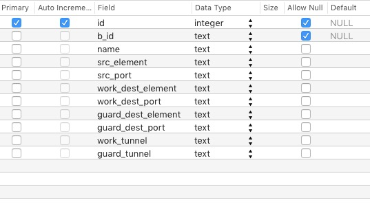
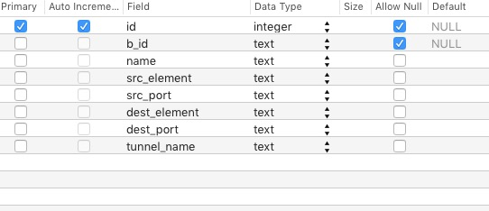
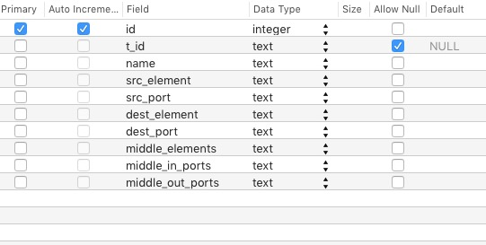
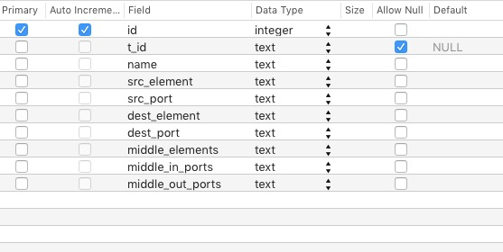
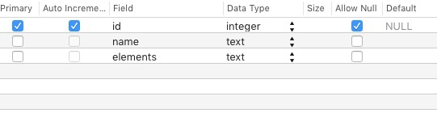
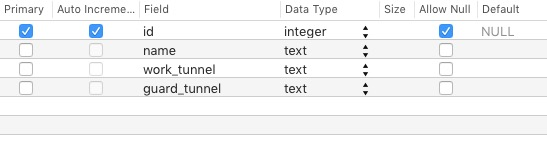
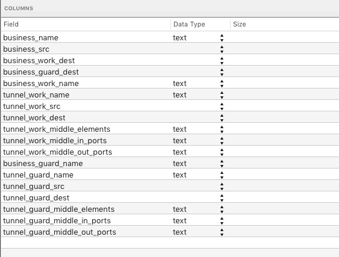
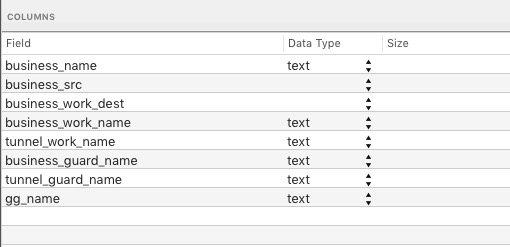
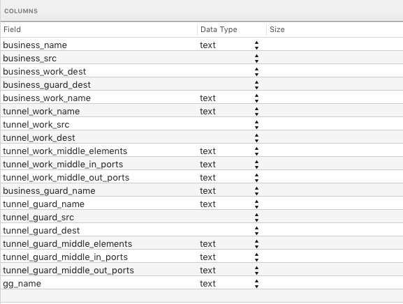

# Tunnel Inspector

TunnelInspector 是基于 electron 框架编写的一个工具, 用于检视业务的共同节点, 为优化业务提供决策依据.


当前的业务痛点: 省略3000字.
自动化的优势: 省略...
主要的功能是: 导入csv格式的业务数据, 隧道数据, 经过分析, 寻找工作路由和保护路由的逻辑同节点, 逻辑同路由, 物理同路由, 并将信息汇总导出. 


使用的第三方开源代码:
- [electron](https://electron.atom.io/), electron 封装了开源浏览器 Chromium 以及服务端的 JavaScript 引擎 [nodejs](https://nodejs.org/), 因此可以用JavaScript/HTML/CSS等Web技术来开发桌面应用, 同时借助nodejs海量的第三方包, 桌面应用的开发效率得到很大提升.
- [semantic-ui](https://semantic-ui.com), 界面框架, 提供了大量的界面控件, 如表格/文本框/列表/按钮/对话框等, 可在没有设计师的情况下, 制作精美的界面.
- [papapase](http://papaparse.com/), 用于把csv文件解析为JavaScript对象.
- [node-sqlite3](https://github.com/mapbox/node-sqlite3), 轻量级数据库sqlite3的nodejs实现, 用于实现数据的存储.

软件主体分为三个部分:
- 将csv文件存入数据库基本表
- 从基本表构建数据库视图
- 从数据库导出到csv文件.

## 第一部分 导入

### 数据库设计

共设计了6个基本表(代码在csv.js: createTables函数中), 分别是:

- lte_businesses

    用于存储LTE业务表的相关数据
    
    

- non_lte_businesses

    存储非LTE业务:
    
    
    
    - b_id: 业务ID
    - name: 业务名称
    - src_element: 源网元
    - src_port: 源网元端口
    - dest_element: 宿网元
    - dest_port: 宿网元端口
    - tunnel_name: 隧道名称
- lte_tunels

    存储LTE隧道的数据
    
    

- non_lte_tunnels

    非LTE隧道
    
    

    - t_id: 隧道ID
    - name: 隧道名称
    - src_element: 源网元
    - src_port: 源网元端口
    - dest_element: 宿网元
    - src_port: 宿网元端口
    - middle_elements: 中间网元节点
    - middle_in_ports: 入端口
    - middle_out_ports: 出端口

- physical_tunnels

    物理隧道
    
    

- non_lte_tunnels_guard_group

    非LTE业务保护组
    
    

### 解析CSV

软件支持导入csv格式的数据, csv是纯文本, 处理简单, 可以流读取, 一部分一部分地读入处理, 再读入再处理的工作方式. 而excel不同, 需要全部读入内存, 业务量太大时, 会耗尽内存.

代码在csv.js:extractFile()中.

解析LTE业务时(函数csv.js:extractBusinesses), 逐行读入csv文件, 如果某行的文本内容符合正则表达式`/^[是|否],[0|1],.*?,.*?,\d*?,.*?,.*?,.+?,.*?,工作,/i`, 那么是包含了工作隧道的内容, 把该行的数据提取出来. 根据业务文件的规律, 它的下一行肯定包含了保护隧道的内容, 提取出来, 跟上一行提取出的内容一起插入到数据表lte_businesses中.

其他文件同理, 都是根据正则表达式进行数据的提取, 所以非常依赖业务文件的格式. 一旦文件格式改变, 可能就获取到不正确的数据.

## 第二部分 数据库视图设计

把所有数据导入到基本表后, 就可以构造数据库视图了. 视图是虚表, 视图中的字段均由基本表组成, 它仅呈现数据而不实际存储数据, 故称视图. 一共设计了三个表视图:

- lte_common_logical_view

    
    
    用于呈现LTE业务的共同路由, 视图中的各字段来由为:
    ```sql
    CREATE VIEW lte_common_logical_view as
      select
      b.name as business_name,
      (b.src_element || "-" || b.src_port) as business_src,
      (b.work_dest_element || "-" || b.work_dest_port) as business_work_dest,
      (b.guard_dest_element || "-" || b.guard_dest_port) as business_guard_dest,
      b.work_tunnel as business_work_name,
      w.name as tunnel_work_name,
      (w.src_element || "-" || w.src_port) as tunnel_work_src,
      (w.dest_element || "-" || w.dest_port) as tunnel_work_dest,
      w.middle_elements as tunnel_work_middle_elements,
      w.middle_in_ports as tunnel_work_middle_in_ports,
      w.middle_out_ports as tunnel_work_middle_out_ports,
      b.guard_tunnel as business_guard_name,
      g.name as tunnel_guard_name,
      (g.src_element || "-" || g.src_port) as tunnel_guard_src,
      (g.dest_element || "-" || g.dest_port) as tunnel_guard_dest,
      g.middle_elements as tunnel_guard_middle_elements,
      g.middle_in_ports as tunnel_guard_middle_in_ports,
      g.middle_out_ports as tunnel_guard_middle_out_ports
      from lte_businesses as b
      left join lte_tunnels as w
        on b.work_tunnel = w.name
      left join lte_tunnels as g
        on b.guard_tunnel = g.name
    ```
- non_lte_b_t_view

    
    
    非LTE业务的工作隧道和路由隧道:
    ```sql
    CREATE VIEW non_lte_b_t_view as
      select
      b.name as business_name,
      (b.src_element || "-" || b.src_port) as business_src,
      (b.dest_element || "-" || b.dest_port) as business_work_dest,
      b.tunnel_name as business_work_name,
      t.work_tunnel as tunnel_work_name,
      t.guard_tunnel as business_guard_name,
      t.guard_tunnel as tunnel_guard_name,
      t.name as gg_name
      from non_lte_businesses as b
      left join non_lte_tunnels_guard_group as t
        on b.tunnel_name = t.work_tunnel
    ```
- non_lte_common_logical_view

    
    
    非LTE业务的共同路由:
    ```sql
    CREATE VIEW non_lte_common_logical_view as
      select
      b.business_name as business_name,
      b.business_src as business_src,
      b.business_work_dest as business_work_dest,
      (g.dest_element || "-" || g.dest_port) as business_guard_dest,
      b.business_work_name as business_work_name,
      w.name as tunnel_work_name,
      (w.src_element || "-" || w.src_port) as tunnel_work_src,
      (w.dest_element || "-" || w.dest_port) as tunnel_work_dest,
      w.middle_elements as tunnel_work_middle_elements,
      w.middle_in_ports as tunnel_work_middle_in_ports,
      w.middle_out_ports as tunnel_work_middle_out_ports,
      b.business_guard_name as business_guard_name,
      g.name as tunnel_guard_name,
      (g.src_element || "-" || g.src_port) as tunnel_guard_src,
      (g.dest_element || "-" || g.dest_port) as tunnel_guard_dest,
      g.middle_elements as tunnel_guard_middle_elements,
      g.middle_in_ports as tunnel_guard_middle_in_ports,
      g.middle_out_ports as tunnel_guard_middle_out_ports,
      b.gg_name as gg_name
      from non_lte_b_t_view as b
      left join non_lte_tunnels as w
        on b.business_work_name = w.name
      left join non_lte_tunnels as g
        on b.business_guard_name = g.name
    ```

## 第三部分 导出

    
  导出字段共有: '业务名称', '保护形式', '源网元信息', '宿网元信息', '承载Tunnel名称', '承载Tunnel路由', '逻辑同路由', '逻辑同节点', '物理同路由'. 其中每个业务都导出两行记录, 分别对应工作路由和保护路由的信息.
  
  因为所有的信息都已在汇聚在`lte_common_logical_view`和`non_lte_common_logical_view`视图中了, 直接导出即可. 导出时每从数据库查询一行就将内容写入磁盘, 写入后即释放记录所占有的内存空间, 这使得导出时程序的内存占用很低, 可以适用海量的业务量.
  
## 第四部分 优点以及局限性

优点:
- 跨平台, 可以在Windows, Linux, macOS上运行
- 文件流读取/写入, 可以处理海量业务
- 借助sqlite数据库的优异性能, 导入导出效率良好

缺点:
- 因为封装了浏览器和nodejs引擎, 程序体积较大
- 只支持导入csv格式文件, 而系统导出的为excel文件, 需要手动执行格式转换
- 导入功能和现有系统导出格式严重耦合, 如果格式改变, 导入功能将可能无法使用

展望:
- 如果能获取系统数据库的读取权限, 直接导入所需的字段, 将事半功倍.


## 附录: 代码结构


```
├── app
├── csv.js: 主要的逻辑
├── custom.css: 界面css
├── dist: 生成的exe文件所在
├── index.html: 界面html
├── inspector.js: 界面的跳转/菜单等
├── js
├── logo.ico: 程序logo
├── main.js: 定义程序界面的原始尺寸
├── node_modules: 第三方库文件
├── package-lock.json
├── package.json: 程序依赖的第三方库
├── semantic: 界面库
├── semantic.json
└── test: 测试
```
